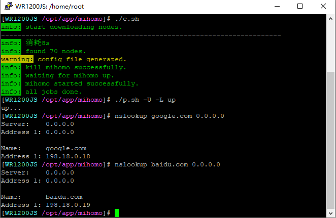
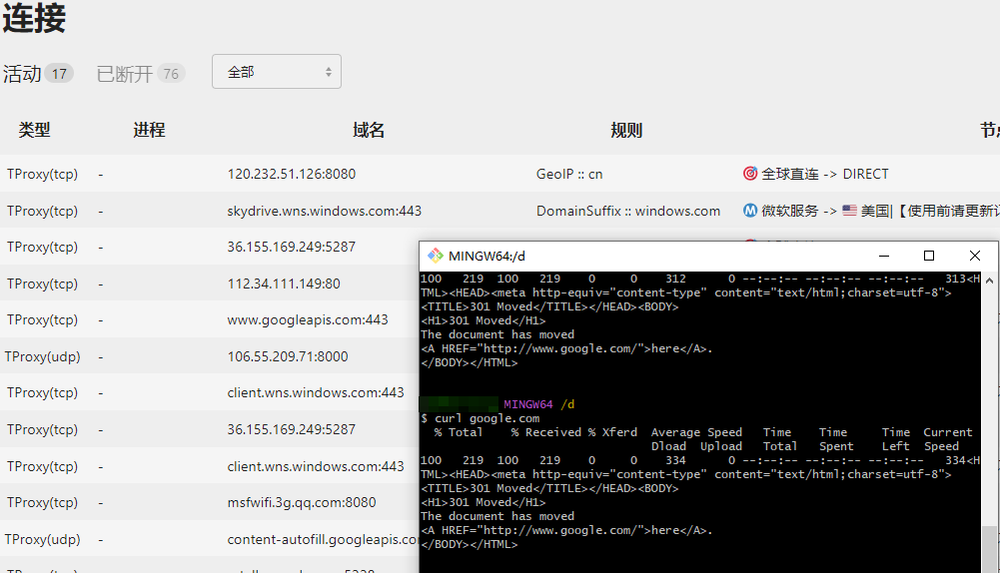

# mihomo-tproxy
- mihomo(clash)透明代理shell脚本，mihomo+tproxy
- 仅使用iptables+mihomo实现透明代理，不需要其他软件
- 本脚本在padavan上实现基于tproxy+mihomo的透明代理，支持UDP代理，支持代理路由器自身

## 参数说明
```
usage: ./p.sh [-L] [-U] up|down
 -L: 启用透明代理本机
 -U: 启用代理UDP
 up: 开启透明代理  down: 关闭透明代理
```
- 脚本中的参数（需要与[mihomo-auto](https://github.com/Js-Sung/mihomo-auto)中的ts.yaml配置保持一致）

| 变量   |   说明 |
|  :--  | :-- |
| CLASH_DNSPORT | mihomo的DNS监听端口 |
| CLASH_RTMARK | mihomo的出站流量标记，根据此标记可防止mihomo流量死循环 |
| CLLASH_TPPROT | mihomo的tproxy端口 |

## 使用说明
- 下载[mihomo-auto](https://github.com/Js-Sung/mihomo-auto)仓库中的文件来启动mihomo
- 下载本仓库的p.sh，执行./p.sh -L -U up启动透明代理（执行./p.sh down可关闭透明代理）
- [mihomo-auto](https://github.com/Js-Sung/mihomo-auto)中启用了fake-ip模式，如果nslookup返回fake-ip说明DNS成功劫持给mihomo处理





- 在crontab中添加以下内容，可以配合[mihomo-auto](https://github.com/Js-Sung/mihomo-auto)订阅脚本实现定时执行
```
8 4 * * * /path/p.sh down && /path/c.sh && /path/p.sh -L -U up
```
