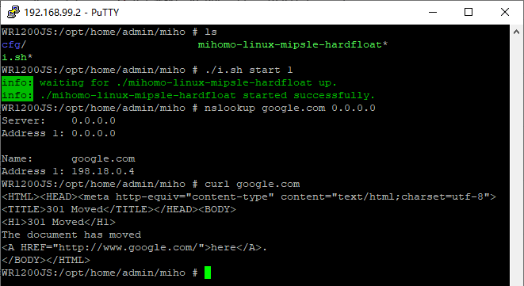
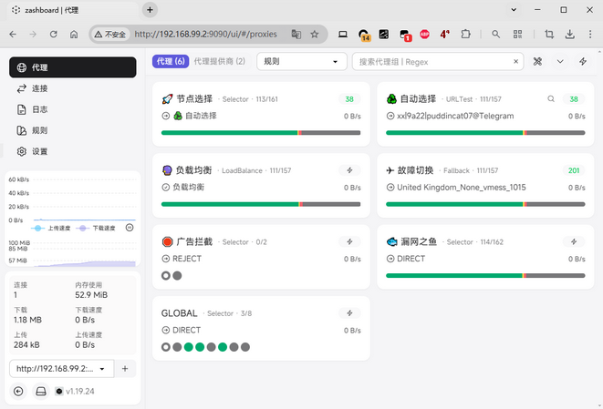

# mihomo一键式透明代理

在padavan路由器上一键开启mihomo透明代理，支持udp代理，支持代理路由器自身。

## 特点
1. 一键启动mihomo，配合iptables实现透明代理。
2. 免维护，一次启动后，后续自动定期更新订阅。（更新时间间隔见config.yaml的proxy-providers下的interval参数）
3. 操作简易，可以在webUI中更新皮肤和mihomo核心等操作。

## 使用
1. 下载本仓库的内容，下载mihomo并放在i.sh所在目录，并赋予mihomo和i.sh可执行权限。
2. 执行以下命令启动，$2=1表示开启本机代理，$3=1表示开启UDP代理，默认关闭。
```
./i.sh start 1 0
```
3. 访问```http://yourip:9090/ui```，密码默认是123456，无误后可以将命令加入crontab中以实现mihomo和代理规则保活。
```
*/5 * * * * /path/i.sh start 1 0   # 启用本机代理，不代理UDP，5分钟检查一次
```





## 注意
1. 第一次启动会下载皮肤、订阅链接、GEO规则等文件，需要几分钟才能就绪。如果有异常，请执行下面的命令检查mihomo日志打印。
```
./i.sh stop
./mihomo-linux-mipsle-hardfloat -d cfg/
```
2. config.yaml中采用了订阅转换器和免费节点，可以换成你自己的。
3. 如果路由器性能较好，可以换用```config0.yaml```，ruleset更全且能定期更新。

## 参考
1. [mihomo](https://github.com/MetaCubeX/mihomo)
2. 免费节点：[①BestClash](https://github.com/PuddinCat/BestClash) [②Free-servers](https://github.com/Pawdroid/Free-servers) [③chromego_merge](https://github.com/Misaka-blog/chromego_merge)
3. [订阅转换](https://github.com/Js-Sung/sub2clashmeta)
4. [树莓派 Clash 透明代理(TProxy)](https://mritd.com/2022/02/06/clash-tproxy/)
